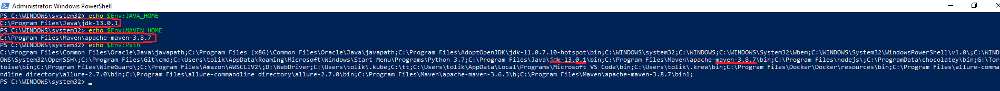
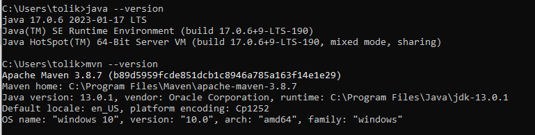
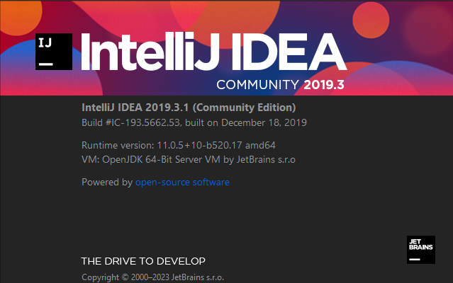
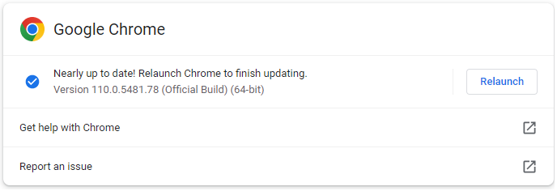

# Automated tests

## Installing Required Software

  - Intelij IDEA - https://www.jetbrains.com/ru-ru/idea/download/#section=windows or https://www.jetbrains.com/ru-ru/idea/download/download-thanks.html?platform=windows&code=IIC

  - JDK & JRE - https://www.oracle.com/java/technologies/downloads/ or https://download.oracle.com/java/17/latest/jdk-17_windows-x64_bin.msi

  - Maven - https://maven.apache.org/download.cgi or https://dlcdn.apache.org/maven/maven-3/3.9.6/binaries/apache-maven-3.9.6-bin.zip

  - Chrome driver - https://chromedriver.chromium.org/downloads or https://edgedl.me.gvt1.com/edgedl/chrome/chrome-for-testing/121.0.6167.85/win64/chromedriver-win64.zip
    
  - Firefox - https://github.com/mozilla/geckodriver/releases or https://github.com/mozilla/geckodriver/releases/download/v0.34.0/geckodriver-v0.34.0-win32.zip


## Setting system environment variables in `Windows` OS

- Open `PowerShell` as Administrator and run commans

```
[Environment]::SetEnvironmentVariable("JAVA_HOME", "C:\Program Files\Java\jdk-14.0.2", "Machine")
[Environment]::SetEnvironmentVariable("MAVEN_HOME", "C:\Program Files\apache-maven-3.8.6", "Machine")
[Environment]::SetEnvironmentVariable("Path", $Env:Path + ';' + $Env:JAVA_HOME + '\bin', "Machine")
[Environment]::SetEnvironmentVariable("Path", $Env:Path + ';' + $Env:MAVEN_HOME + '\bin', "Machine")
```

- Check system variable. Open new `PowerShell` and run commands

```
echo $Env:JAVA_HOME
echo $Env:MAVEN_HOME
echo $Env:Path
```



## Environment versions (this is just an example)

 - java and maven
  


 - IntellijIdea
  


 - chrome



 - firefox


  - WebDriverManager - https://bonigarcia.dev/webdrivermanager/#driver-management