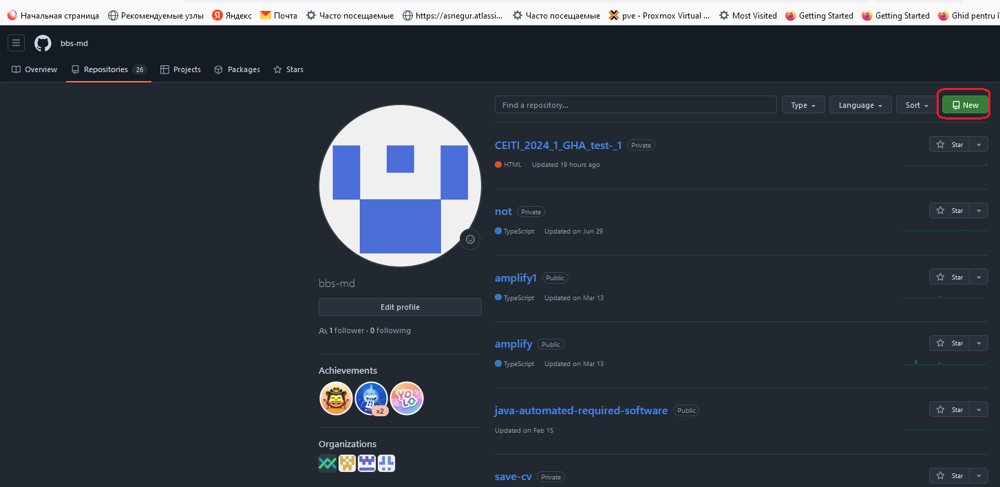
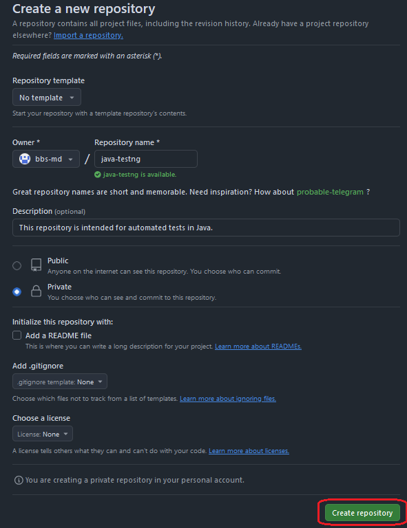
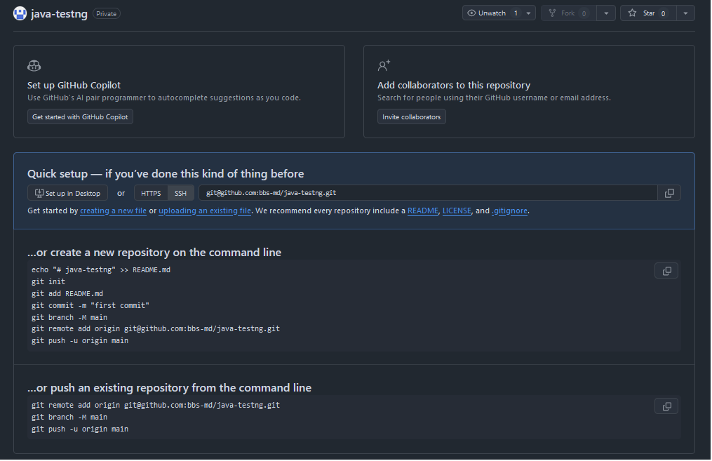

## Create `GitHub` repo
#### Create new repo







####    Quick setup
##### 1. Create a new repository on the command line

```bash
echo "# java-testng" >> README.md
git init
git add README.md
git commit -m "first commit"
git branch -M main
git remote add origin git@github.com:bbs-md/java-testng.git
git push -u origin main
```

##### 2. Or push an existing repository from the command line

```aidl
git remote add origin git@github.com:bbs-md/java-testng.git
git branch -M main
git push -u origin main
```

#### 3. Copy files:
* `.github/workflow/test_java.yml`
* `docker-compose`
* `config/browsers.json`

to the root of the project.

#### 4. Setup remote `webdriver`
See the example in the `SeleniumDriver.java` file.

Every time you push a branch to the repository, a check will be run in `Github Actions`

## References
1. [git](https://git-scm.com/)
2. [github](https://docs.github.com/en)
3. [github actions](https://docs.github.com/en/actions/about-github-actions/understanding-github-actions)